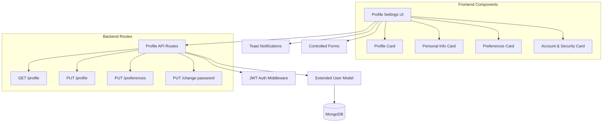

# Design Document

## Overview

The Profile Settings system extends the existing MERN breathing & meditation app with comprehensive user profile management capabilities. The system provides a modern, card-based UI for users to manage personal information, notification preferences, and account security while maintaining the app's existing JWT authentication and MongoDB data architecture.

The design follows the existing app patterns with Express.js protected routes, Mongoose models, and React components styled with TailwindCSS. The system integrates seamlessly with the current User model and authentication middleware while adding new profile and preference management capabilities.

## Architecture

### System Components



### Data Flow

1. **Profile Loading**: Component mounts → API call → Database query → UI update
2. **Profile Updates**: Form submission → Validation → API call → Database update → UI feedback
3. **Preference Changes**: Toggle interaction → Immediate UI update → API call → Database persistence
4. **Password Change**: Form submission → Current password verification → New password hashing → Database update

## Components and Interfaces

### Backend Components

#### Extended User Model Schema

```javascript
// Additional fields to existing User schema
{
  profile: {
    phone: { type: String, trim: true },
    location: { type: String, trim: true },
    avatar: { type: String, default: '' } // URL or placeholder string
  },
  preferences: {
    notifications: { type: Boolean, default: true },
    dailyReminders: { type: Boolean, default: true },
    achievementAlerts: { type: Boolean, default: true },
    emailUpdates: { type: Boolean, default: false }
  }
}
```

#### API Route Interfaces

**GET /api/user/profile**
- **Purpose**: Retrieve complete user profile data
- **Authentication**: JWT required
- **Response**: User object with profile, preferences, stats, and achievements
- **Status Codes**: 200 (success), 401 (unauthorized), 404 (user not found)

**PUT /api/user/profile**
- **Purpose**: Update user profile information
- **Authentication**: JWT required
- **Body**: `{ name, email, profile: { phone, location, avatar } }`
- **Validation**: Email format, required fields, data sanitization
- **Response**: Updated user object
- **Status Codes**: 200 (success), 400 (validation error), 401 (unauthorized)

**PUT /api/user/preferences**
- **Purpose**: Update user notification preferences
- **Authentication**: JWT required
- **Body**: `{ notifications, dailyReminders, achievementAlerts, emailUpdates }`
- **Response**: Updated preferences object
- **Status Codes**: 200 (success), 400 (validation error), 401 (unauthorized)

**PUT /api/user/change-password**
- **Purpose**: Securely change user password
- **Authentication**: JWT required
- **Body**: `{ currentPassword, newPassword, confirmPassword }`
- **Security**: bcrypt verification of current password, hashing of new password
- **Response**: Success message (no sensitive data)
- **Status Codes**: 200 (success), 400 (validation/mismatch), 401 (wrong current password)

### Frontend Components

#### ProfilePage Component

**Purpose**: Main container component for profile settings interface
**Props**: None (uses AuthContext for user data)
**State Management**: 
- Profile data from API
- Form states for editing
- Loading and error states
- Toast notifications

**Layout Structure**:
```jsx
<div className="profile-settings-container">
  <Header />
  <div className="grid-layout">
    <ProfileCard />
    <PersonalInfoCard />
    <PreferencesCard />
    <AccountSecurityCard />
  </div>
</div>
```

#### ProfileCard Component

**Purpose**: Display user avatar, name, email, and statistics
**Props**: `{ user, stats, memberSince }`
**Features**:
- Circular avatar with initials fallback
- Member since date calculation
- Statistics display (sessions, streak)
- Edit avatar placeholder functionality

#### PersonalInfoCard Component

**Purpose**: Editable form for personal information
**Props**: `{ user, onUpdate }`
**State**: Form data, edit mode, validation errors
**Features**:
- Toggle between view and edit modes
- Controlled form inputs
- Real-time validation
- Save/cancel functionality

#### PreferencesCard Component

**Purpose**: Toggle switches for notification preferences
**Props**: `{ preferences, onUpdate }`
**Features**:
- Animated toggle switches
- Immediate visual feedback
- Optimistic UI updates
- Error handling with revert

#### AccountSecurityCard Component

**Purpose**: Navigation to account management functions
**Props**: `{ onPasswordChange, onSignOut }`
**Features**:
- Password change modal/navigation
- Privacy settings navigation
- Help & support navigation
- Sign out functionality

## Data Models

### User Model Extensions

The existing User model will be extended with two new embedded objects:

```javascript
// Profile information
profile: {
  phone: String,      // Optional phone number
  location: String,   // Optional location (city, state)
  avatar: String      // Avatar URL or placeholder string
}

// Notification preferences
preferences: {
  notifications: Boolean,      // General app notifications
  dailyReminders: Boolean,     // Daily practice reminders
  achievementAlerts: Boolean,  // Achievement unlock notifications
  emailUpdates: Boolean        // Weekly progress emails
}
```

### API Response Formats

**Profile Response**:
```json
{
  "success": true,
  "data": {
    "_id": "user_id",
    "name": "Sarah Johnson",
    "email": "sarah.j@email.com",
    "profile": {
      "phone": "+1 (555) 123-4567",
      "location": "San Francisco, CA",
      "avatar": ""
    },
    "preferences": {
      "notifications": true,
      "dailyReminders": true,
      "achievementAlerts": false,
      "emailUpdates": true
    },
    "stats": {
      "streak": 7,
      "totalSessions": 48,
      "totalMinutes": 240,
      "longestStreak": 14
    },
    "achievements": [...],
    "createdAt": "2024-01-15T00:00:00.000Z"
  }
}
```

**Error Response**:
```json
{
  "success": false,
  "message": "Validation error",
  "errors": {
    "email": "Invalid email format",
    "phone": "Invalid phone number format"
  }
}
```

## Correctness Properties

*A property is a characteristic or behavior that should hold true across all valid executions of a system—essentially, a formal statement about what the system should do. Properties serve as the bridge between human-readable specifications and machine-verifiable correctness guarantees.*

### Property 1: Profile Data Display Consistency
*For any* user with profile data, when the profile settings page loads, all profile fields (name, email, phone, location) should be correctly displayed in the UI
**Validates: Requirements 1.1**

### Property 2: Profile Update Persistence
*For any* valid profile data update, when a user saves changes, the updated data should be correctly stored in the database and reflected in subsequent API calls
**Validates: Requirements 1.3, 8.1**

### Property 3: Profile Update UI Feedback
*For any* successful profile update, the UI should display a success notification and immediately show the updated information without requiring a page refresh
**Validates: Requirements 1.4**

### Property 4: Input Validation Error Handling
*For any* invalid profile data (invalid email format, empty required fields), the system should reject the update and display specific error messages for each invalid field
**Validates: Requirements 1.5, 6.4**

### Property 5: Statistics Display Accuracy
*For any* user, when viewing their profile, the displayed statistics (member since date, total sessions, current streak) should accurately reflect the data stored in their user record
**Validates: Requirements 2.1, 2.2, 2.3, 2.4**

### Property 6: Preference Toggle Persistence
*For any* preference setting change, when a user toggles a preference, the change should be immediately saved to the database and persist across sessions
**Validates: Requirements 3.3**

### Property 7: Preference UI Responsiveness
*For any* preference toggle interaction, the UI should immediately reflect the change visually, and if the save operation fails, should revert the toggle state and display an error message
**Validates: Requirements 3.2, 3.4**

### Property 8: Password Change Security
*For any* password change attempt, the system should verify the current password using bcrypt before allowing the change, and reject attempts with incorrect current passwords
**Validates: Requirements 4.2, 4.3**

### Property 9: Password Change Process
*For any* successful password change with correct current password, the new password should be properly hashed with bcrypt and stored in the database, and the UI should display success feedback
**Validates: Requirements 4.4, 4.5**

### Property 10: Avatar Display Logic
*For any* user, the profile should display their avatar if set, or generate initials in a colored circle if no avatar is present, consistently across all profile views
**Validates: Requirements 5.1, 5.3, 5.5**

### Property 11: Authentication Protection
*For any* profile API endpoint access, the system should verify JWT authentication and return 401 status for unauthenticated requests
**Validates: Requirements 6.1, 6.2**

### Property 12: Data Access Security
*For any* authenticated user, profile API calls should return only that user's own data and never expose other users' information
**Validates: Requirements 6.3**

### Property 13: Response Data Sanitization
*For any* profile API response, the returned data should not contain sensitive information such as password hashes or internal system data
**Validates: Requirements 6.5**

### Property 14: Sign Out Functionality
*For any* sign out action, the system should clear authentication tokens, update the UI state, and redirect to the login page
**Validates: Requirements 7.4**

### Property 15: Data Freshness on Load
*For any* profile page load, the UI should fetch and display the most current user data from the server
**Validates: Requirements 8.2**

### Property 16: Network Error Handling
*For any* network error during profile operations, the UI should display appropriate error messages and maintain a consistent state
**Validates: Requirements 8.3**

## Error Handling

### Client-Side Error Handling

**Form Validation Errors**:
- Real-time validation for email format, required fields
- Display inline error messages with specific guidance
- Prevent form submission until all validation passes
- Clear error messages when fields are corrected

**Network Error Handling**:
- Display toast notifications for API failures
- Implement retry mechanisms for transient failures
- Graceful degradation when server is unavailable
- Loading states during API operations

**Authentication Errors**:
- Redirect to login page on 401 responses
- Clear local authentication state
- Display appropriate error messages

### Server-Side Error Handling

**Validation Errors**:
- Comprehensive input validation using Mongoose schemas
- Sanitization of user input to prevent injection attacks
- Structured error responses with field-specific messages
- HTTP status codes following REST conventions

**Authentication Errors**:
- JWT token verification and expiration handling
- Secure password verification using bcrypt
- Rate limiting for password change attempts
- Audit logging for security events

**Database Errors**:
- Connection error handling with retry logic
- Transaction rollback for failed operations
- Duplicate key error handling (email uniqueness)
- Graceful handling of database unavailability

## Testing Strategy

### Unit Testing Approach

**Backend Unit Tests**:
- Test individual API route handlers with mocked dependencies
- Test User model methods and validation logic
- Test authentication middleware functionality
- Test password hashing and verification
- Test input validation and sanitization

**Frontend Unit Tests**:
- Test individual component rendering and behavior
- Test form validation logic
- Test API integration functions
- Test authentication context functionality
- Test error handling and user feedback

### Property-Based Testing Configuration

**Testing Framework**: Use **fast-check** for JavaScript property-based testing
**Test Configuration**: Minimum 100 iterations per property test
**Test Organization**: Co-locate property tests with unit tests using `.test.js` suffix

**Property Test Examples**:

```javascript
// Example property test structure
describe('Profile Update Property Tests', () => {
  test('Property 2: Profile Update Persistence', () => {
    // Tag: Feature: profile-settings, Property 2: Profile Update Persistence
    fc.assert(fc.property(
      fc.record({
        name: fc.string({ minLength: 1, maxLength: 50 }),
        email: fc.emailAddress(),
        phone: fc.option(fc.string()),
        location: fc.option(fc.string())
      }),
      async (profileData) => {
        // Test that valid profile updates persist correctly
        const response = await updateProfile(profileData);
        const savedData = await getProfile();
        expect(savedData).toMatchObject(profileData);
      }
    ), { numRuns: 100 });
  });
});
```

### Integration Testing

**API Integration Tests**:
- Test complete request/response cycles
- Test authentication flow integration
- Test database persistence across operations
- Test error scenarios with real database

**UI Integration Tests**:
- Test complete user workflows (view → edit → save)
- Test form submission and API integration
- Test navigation and routing
- Test toast notification integration

### Testing Coverage Requirements

**Backend Coverage**:
- All API routes must have unit and integration tests
- All model methods must have unit tests
- All middleware functions must have unit tests
- Property tests for all correctness properties

**Frontend Coverage**:
- All components must have unit tests
- All user interactions must have tests
- All API integration points must have tests
- Property tests for UI behavior properties

**Test Data Management**:
- Use factories for generating test data
- Clean database state between tests
- Mock external dependencies appropriately
- Use realistic test data that matches production patterns